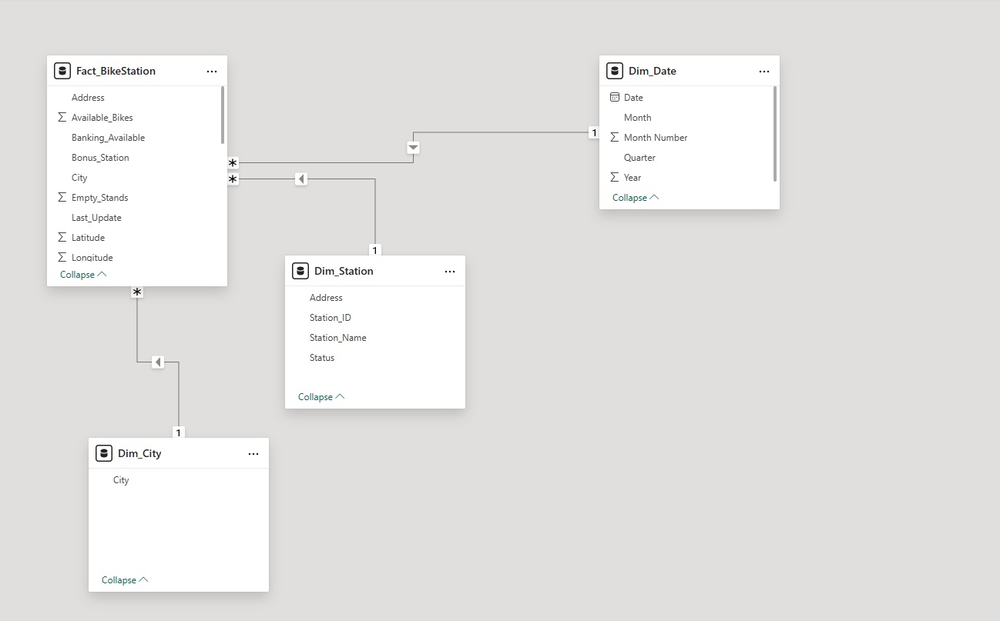
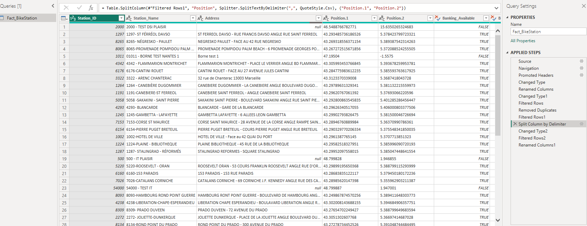
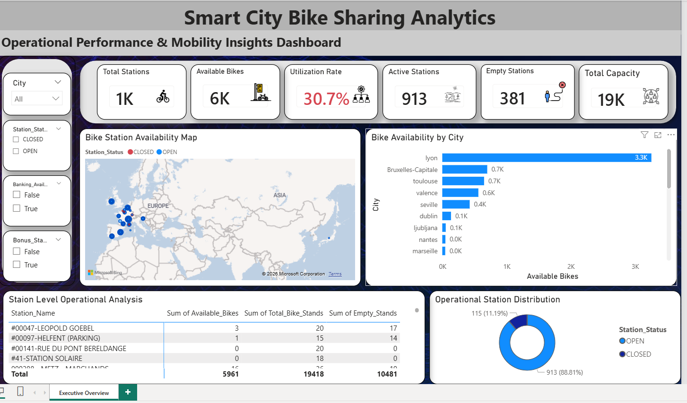

# Smart-City-Bike-Sharing-Analytics-Dashboard
Developed an end-to-end Power BI analytics solution for smart city bike-sharing data featuring KPI tracking, trend analysis, star schema modeling, DAX measures, and business storytelling dashboards.

Project Title
# Smart City Bike Sharing Analytics Dashboard

## Project Overview

This project analyzes bike-sharing operations across multiple cities to identify revenue trends, station utilization, ride efficiency, and operational performance using Power BI.

The dashboard helps stakeholders monitor business KPIs, identify underperforming cities, optimize station usage, and improve overall transportation efficiency.

## Business Problem

Urban bike-sharing companies generate large amounts of trip and station data daily. However, identifying low-performing stations, inefficient routes, and revenue-driving cities becomes difficult without centralized analytics.

This project aims to:
- Track overall operational performance
- Analyze city-wise revenue generation
- Identify underutilized stations
- Monitor yearly revenue trends
- Improve cost and ride efficiency

  ## Dataset Information

- Total Records: 150,000+
- Cities Covered: 12
- Bike Stations: 250+
- Analysis Period: 2021 – 2025
- Data Size: ~25 MB

  ## Tools & Technologies

- Power BI
- Power Query
- DAX
- SQL
- Excel

## Data Cleaning & Transformation

Performed the following preprocessing steps:

- Removed null and duplicate records
- Standardized city and station names
- Created Date Dimension table
- Built star schema data model
- Created calculated columns and measures using DAX
- Optimized relationships for performance

## Key Insights

- New York generated the highest revenue contributing 28% of total revenue.
- Phoenix showed the lowest operational efficiency with high maintenance cost per ride.
- Revenue increased by 18% from 2023 to 2024.
- Top 15 stations contributed nearly 40% of total rides.
- Weekend rides were significantly higher compared to weekdays.

- ## Business Recommendations

- Increase bike allocation in high-demand stations.
- Optimize low-performing routes to reduce operational costs.
- Expand stations in high-revenue cities.
- Implement predictive maintenance for frequently used bikes.
- Improve marketing campaigns in underperforming cities.

  ## Dashboard Screenshots
  ### Executive Overview

## Project Outcome

Successfully developed an end-to-end Power BI analytics solution that transformed raw operational data into actionable business insights, enabling better decision-making for urban mobility management.
